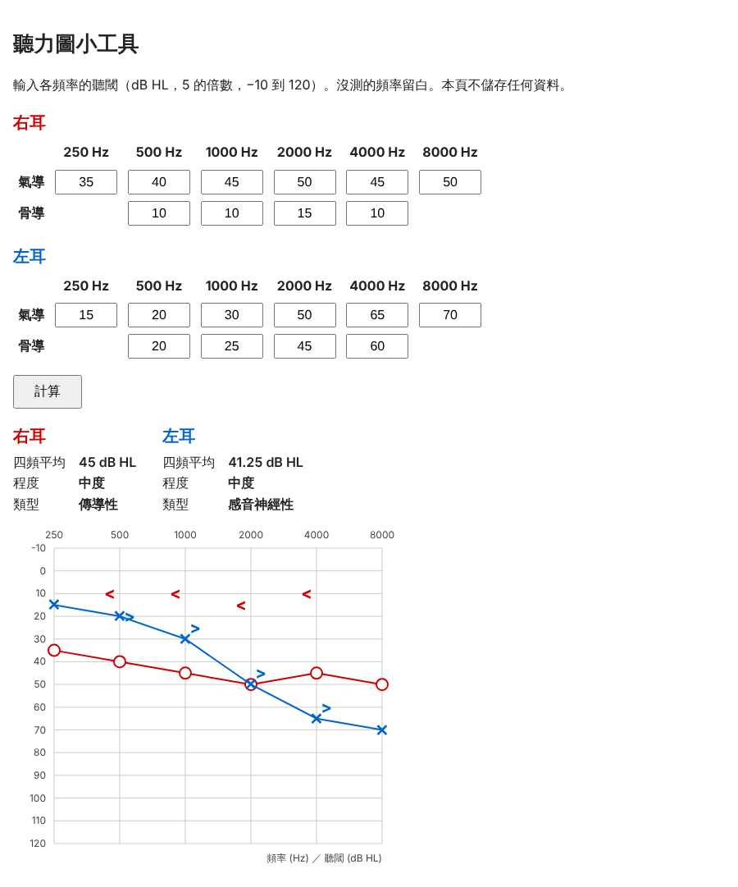

# Audiogram Tool

輸入聽閾、畫出聽力圖，並以規則判斷聽損程度與類型的本機小工具。

A small local web tool for audiologists: enter air- and bone-conduction thresholds for each ear, and get the audiogram plus a rule-based classification of the degree and type of hearing loss.



*The thresholds in the screenshot are made up.*

## What it does

- Separate entry for each ear: air conduction at 250–8000 Hz, bone conduction at 500–4000 Hz
- Four-frequency pure-tone average (500, 1000, 2000, 4000 Hz)
- Degree and type of hearing loss, decided by fixed rules
- A standard audiogram: dB HL increasing downwards, right ear in red circles, left ear in blue crosses, bone conduction as `<` and `>`
- Nothing is saved. Refreshing the page clears everything.

## Classification rules

**Degree**, from the air-conduction PTA (not rounded before comparing):

| PTA (dB HL) | Degree |
|---|---|
| ≤ 25 | 正常 Normal |
| > 25 to 40 | 輕度 Mild |
| > 40 to 55 | 中度 Moderate |
| > 55 to 70 | 中重度 Moderately severe |
| > 70 to 90 | 重度 Severe |
| > 90 | 極重度 Profound |

**Type**, checked in this order. The air-bone gap is the air-conduction PTA minus the bone-conduction PTA.

1. Air-conduction PTA ≤ 25 → 正常 Normal
2. Air-bone gap < 15 → 感音神經性 Sensorineural
3. Air-bone gap ≥ 15 and bone-conduction PTA ≤ 25 → 傳導性 Conductive
4. Air-bone gap ≥ 15 and bone-conduction PTA > 25 → 混合性 Mixed

If any of the four PTA frequencies is missing for air conduction, that ear is reported as having insufficient data. If bone conduction is incomplete, the degree is still shown and the type is left undetermined.

The thresholds live at the top of `audiogram/classify.py`.

## Running it

Requires Python 3.10 or newer.

```bash
python3 -m venv .venv
source .venv/bin/activate
pip install -r requirements.txt
python app.py
```

Then open http://127.0.0.1:5000.

## Tests

```bash
pytest
```

55 tests cover every classification boundary, incomplete data, input validation, and the chart output.

## Project layout

| Path | Purpose |
|---|---|
| `audiogram/classify.py` | PTA, degree and type. Plain Python, no Flask. |
| `audiogram/chart.py` | Where a frequency and dB value sit on the chart |
| `app.py` | The form, input validation, and wiring |
| `templates/index.html` | The page, including the SVG audiogram |
| `tests/` | pytest suite |
| `docs/decisions.md` | Why things are the way they are |
| `docs/roadmap.md` | What is done and what might come next |

## Not in this version

Masking symbols, no-response markers, audiogram configuration (flat, sloping), saving results, login, printing.

## Limitations

This is a calculation aid, not a diagnostic device. The rules are a simplification: they work from averages, so they will not flag a loss confined to one frequency, and they do not account for masking. Clinical judgement decides.

No real patient data is used anywhere in this repository.

## How it was built

I am an audiologist; I set the clinical rules and accepted the result. The code was written with Claude Code following a fixed workflow described in `CLAUDE.md`: requirements as Given/When/Then scenarios, tests before implementation, and a review by a separate agent before committing. That review found that Python's `int()` accepts `1_0` and full-width digits as numbers, which the input check now rejects.
